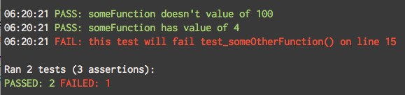

# tdd.h

> A hamfisted attempt to make TDD easier in C

## Abstract

TDD wasn't a thing I was aware of when I used to write C. Years after I'd drunk the TDD Kool-aid, I'm doing projects in C again. 

I working on this publicly so people who are way better at C than I, can tell me how I'm doing this a stupid way and what I can do to make this more useful.

**Why not CUnit/CUT/etc?**

I didn't want to adopt a whole test framework, I just wanted more useful and expressive assertions than those provided by `<assert.h>`.

## Usage

Let's say we have a header file called `myprogram.h` that we want to test:

```c
/* myprgram.h */

#include <stdio.h>

int someFunction() { return 4; }
int someOtherFunction() { return 0; }
```

Our test.c might look like this:
```c
#include <stdio.h>
#include "tdd.h"
#include "myprogram.h"

int test_someFunction() {
  expect("someFunction doesn't value of 100", someFunction() != 100);
  expect("someFunction has value of 4", someFunction() == 4);
  return 0;
}

int test_someOtherFunction() {
  expect("this test will fail", someOtherFunction() == 5);
  return 0;
}

int main() {
  test(test_someFunction);
  test(test_someOtherFunction);
  test_summary();
  return 0;
}
```

**Output**:




